<div align="center">

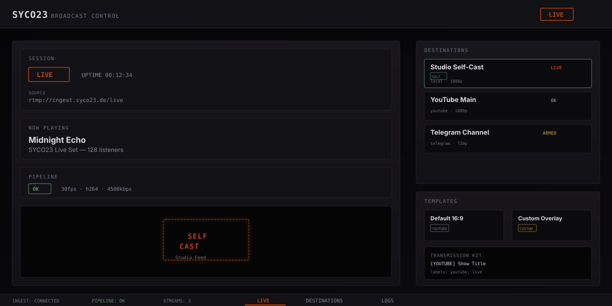

### **SYCO23 BROADCAST CONTROL**

**Multi-destination live streaming operator panel**

Manage RTMP destinations, monitor pipeline health, configure templates, and cast to your local preview — all from a responsive, dark-themed operator interface built with Vue 3 + Vite + TypeScript.

[](https://github.com)
[](https://github.com)
[](https://github.com)
[](LICENSE)

[Features](#features) · [Screenshots](#screenshots) · [Architecture](#architecture) · [Getting Started](#getting-started) · [Local Provider (Self-Cast)](#local-provider-self-cast)

</div>

---

## Features

### Multi-Destination Streaming

Manage up to 10 RTMP destinations simultaneously. Each destination supports independent status cycling, provider-specific configuration, and real-time health monitoring.

| Provider                  | Protocol   | Use Case                        |
| ------------------------- | ---------- | ------------------------------- |
| YouTube                   | RTMPS      | Primary live stream             |
| Telegram                  | RTMPS      | Community broadcast             |
| TikTok                    | RTMPS      | Short-form streaming            |
| Twitch                    | RTMPS      | Gaming/IRL                      |
| Instagram                 | RTMPS      | Mobile-first audience           |
| Mixer, Mixcloud, Facebook | RTMPS      | Additional platforms            |
| Custom RTMP               | RTMPS/RTMP | Any RTMP endpoint               |
| **Local**                 | Internal   | **Self-cast to preview player** |

### Responsive Layout Engine

Five viewport modes automatically detected from window dimensions:

- **Portrait** (< 600px wide) — Mobile-first single column
- **Landscape** (600×400) — Wide mobile
- **Tablet** (1024×768) — Desktop tablet
- **TV** (≥ 1920×1080) — Large display with increased font sizes
- **Desktop** — Default widescreen

### Template & Transmission Kit System

Browse built-in templates or create custom overlays. Generate transmission kits that combine title blocks, description blocks, and metadata labels for each destination.

### Real-Time Log Viewer

Colorized terminal-style log viewer with level filtering (INFO, WARNING, ERROR, SUCCESS, DEBUG) and one-click clear.

### Pipeline Health Monitoring

Live pipeline status with FPS, bitrate, and codec reporting. Watchdog integration for automatic failure detection and recovery.

---

## Screenshots

### Full Desktop View

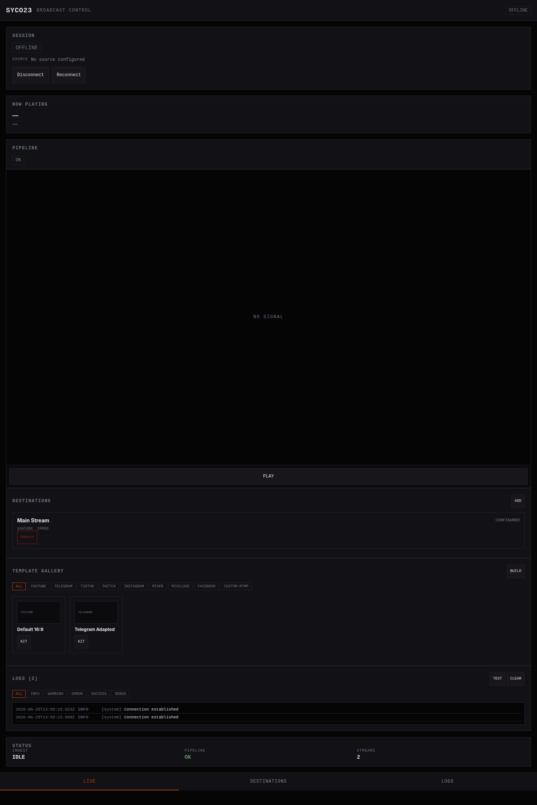

### Layout Modes

| Portrait                                      | Landscape                                       | Tablet                                    | TV                                |
| --------------------------------------------- | ----------------------------------------------- | ----------------------------------------- | --------------------------------- |
| 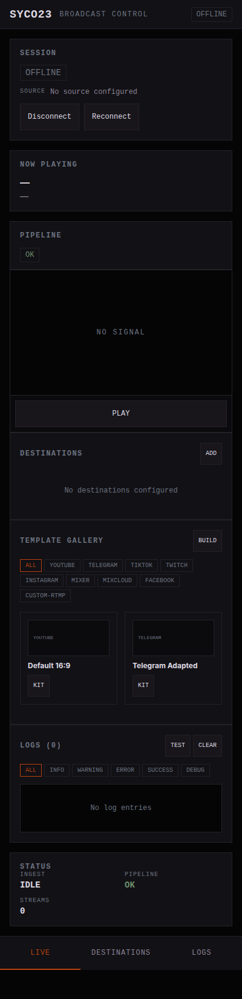 | 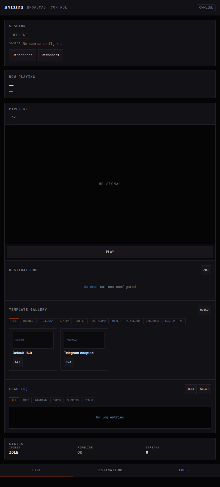 | 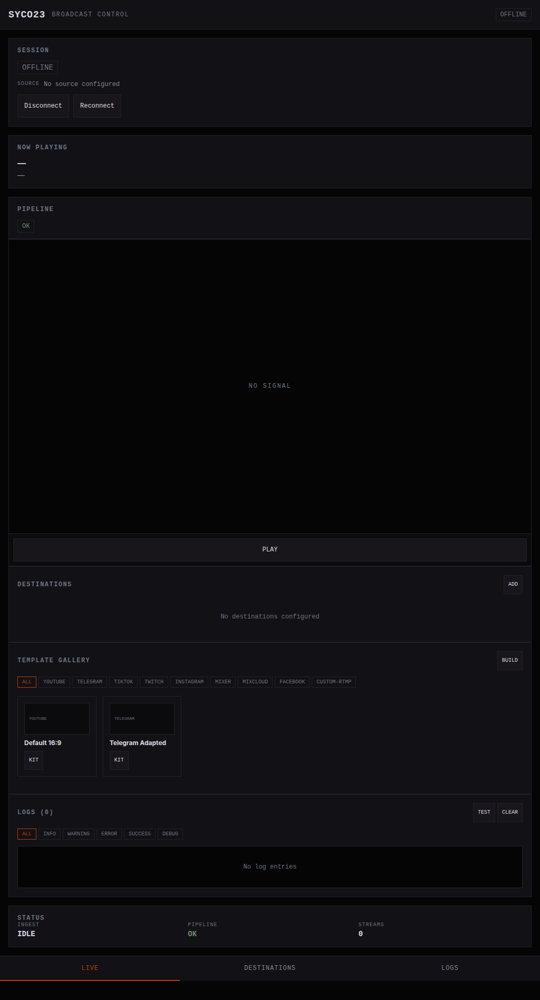 | 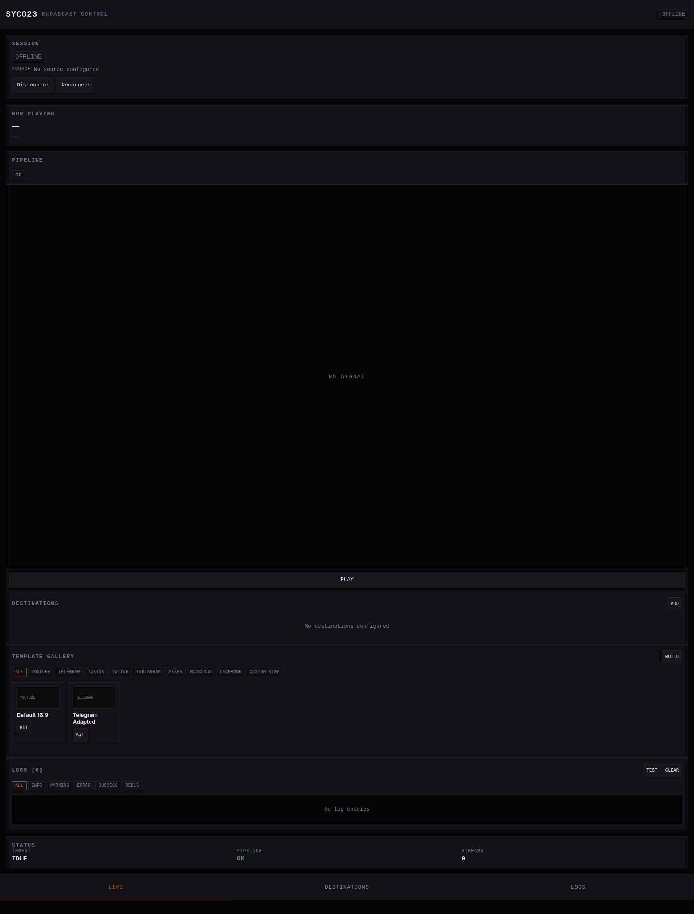 |

### Destination Management

| Empty State                                          | Add Form                                  | Populated                                                    | Status Cycling                               |
| ---------------------------------------------------- | ----------------------------------------- | ------------------------------------------------------------ | -------------------------------------------- |
| 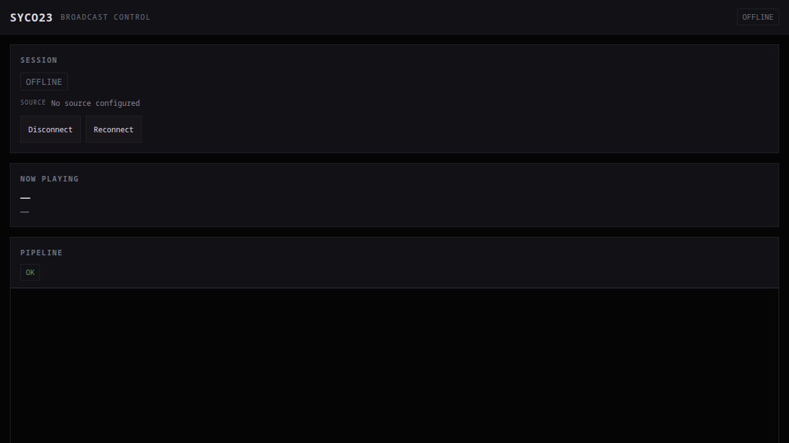 |  | 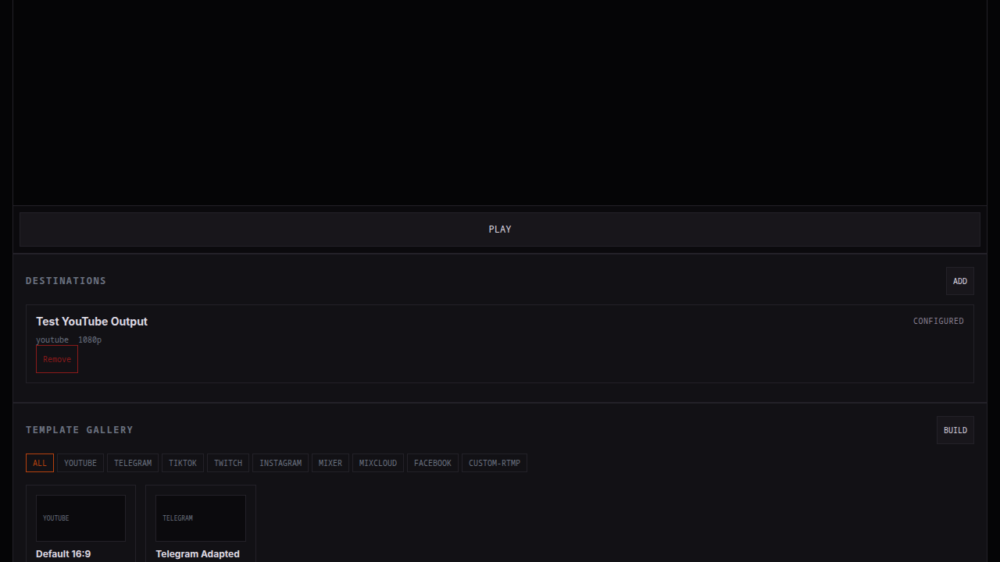 | 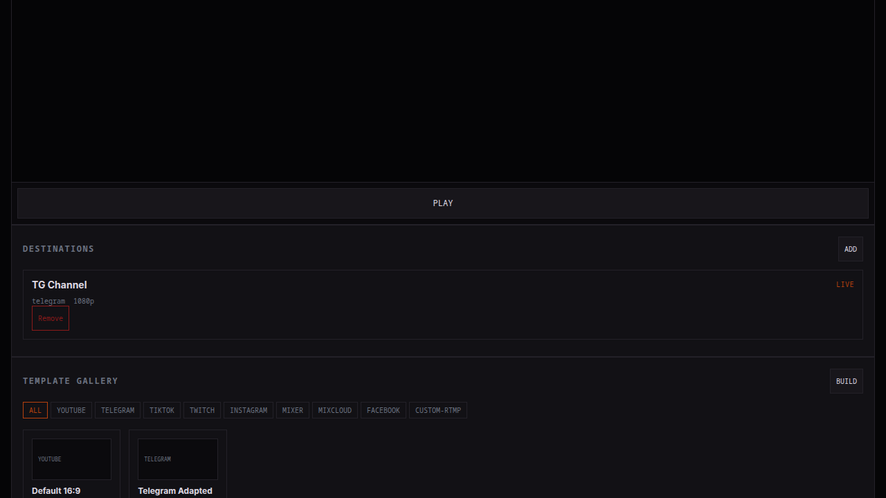 |

### Template Gallery & Transmission Kits


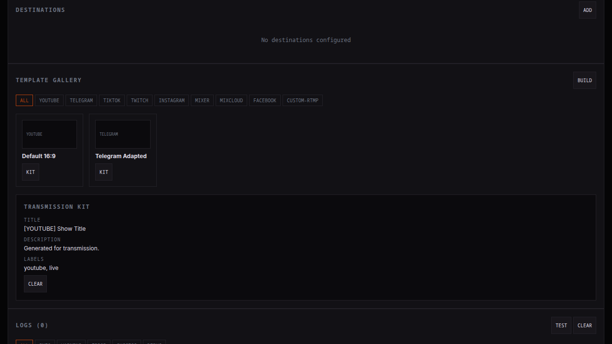

### Log Viewer & Status

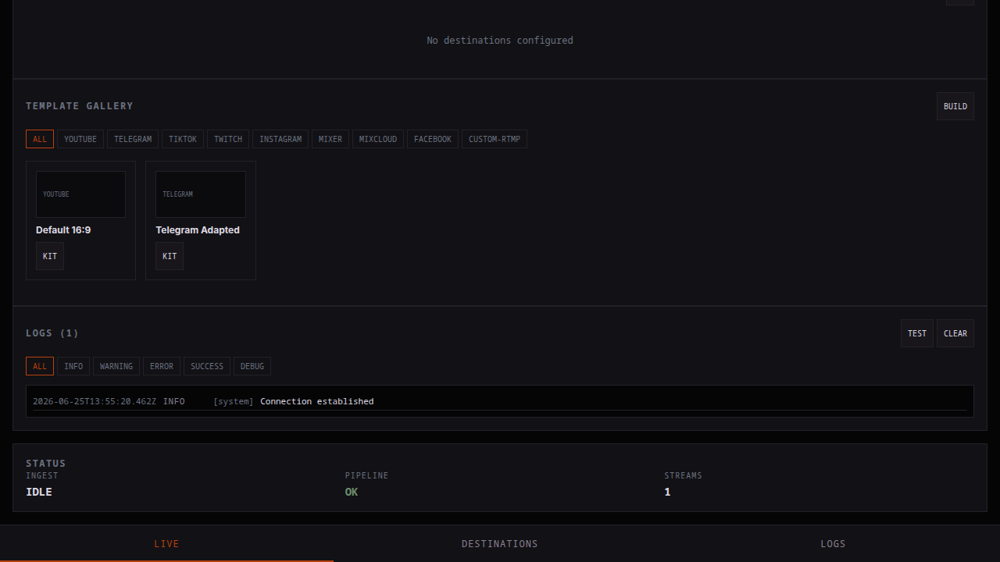


---

## Architecture

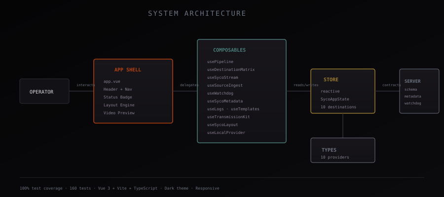

### Design Principles

- **Composables-first** — All business logic lives in Vue 3 composables. Components are thin presentation layers.
- **Single reactive store** — One `reactive<SycoAppState>` instance. No Pinia, no event bus.
- **100% coverage gate** — Vitest enforces 100% on composables, types, and server modules.
- **Framework-agnostic server** — `app/server/` contains pure TypeScript with zero Vue/DOM dependencies.

### Module Map

| Module         | Files | Responsibility             |
| -------------- | ----- | -------------------------- |
| `types/`       | 1     | All TypeScript interfaces  |
| `composables/` | 15    | Business logic layer       |
| `components/`  | 6     | Vue SFC presentation       |
| `server/`      | 4     | Schema, metadata, watchdog |
| `layout/`      | 1     | Viewport detection engine  |

### Tech Stack

```
Vue 3 (Composition API) · Vite 5 · TypeScript 5.4
Vitest 1.x · Playwright 1.x · @vitest/coverage-v8
ESLint 8 · vue-tsc 2.x
```

---

## Local Provider (Self-Cast)

The **local** provider works identically to all other providers in terms of CRUD and status lifecycle, with one key difference: when its status reaches `LIVE`, it casts to the local preview player instead of an external RTMP endpoint.

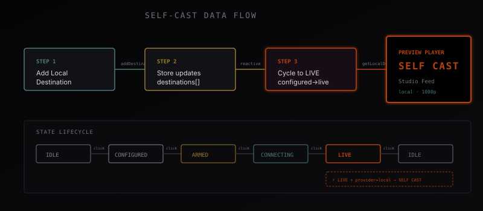

### How It Works

1. **Add** a destination with provider `local`
2. **Cycle** status through the standard lifecycle: `configured → armed → connecting → live`
3. When status reaches `live`, the preview player shows **SELF CAST** with the destination label
4. Cycle back to `idle` to disconnect the self-cast

### Use Cases

- **Preview monitoring** — See your own stream before going live to external platforms
- **Future web player** — Foundation for casting to the public SYCO23 web player
- **Testing** — Verify audio/video without publishing externally

### Key Files

| File                                   | What it does                   |
| -------------------------------------- | ------------------------------ |
| `app/types/index.ts`                   | `'local'` in Provider union    |
| `app/composables/store.ts`             | `getLocalDestination()` helper |
| `app/components/DestinationMatrix.vue` | SELF badge, dropdown option    |
| `app/components/SycoVideoPlayer.vue`   | SELF CAST display              |

---

## Getting Started

### Prerequisites

- Node.js ≥ 18
- npm ≥ 9

### Installation

```bash
git clone https://gitea.brainstation23.synology.me/murphieslaw/syco23-multicast-control.git
cd syco23-multicast-control
npm install
```

### Development

```bash
npm run dev      # Start dev server at http://localhost:5173
```

### Build

```bash
npm run build    # Type-check + production build to dist/
npm run preview  # Preview production build
```

### Testing

```bash
npm run test          # 160 unit + integration tests
npm run test:coverage # With coverage report (100% enforced)
npm run e2e           # Playwright E2E (36 screenshot specs)
```

### All Scripts

| Command                 | Description                   |
| ----------------------- | ----------------------------- |
| `npm run dev`           | Vite dev server               |
| `npm run build`         | Type-check + production build |
| `npm run preview`       | Preview production build      |
| `npm run test`          | Run all unit tests            |
| `npm run test:watch`    | Watch mode                    |
| `npm run test:coverage` | Coverage report               |
| `npm run lint`          | ESLint                        |
| `npm run typecheck`     | TypeScript check              |
| `npm run e2e`           | Playwright E2E                |

---

## Project Structure

```
syco23-multicast-control/
├── app/
│   ├── __tests__/              # Unit & integration tests
│   │   ├── a11y/               # Accessibility tests
│   │   ├── composables/        # Composable tests
│   │   ├── features/           # Feature tests
│   │   └── server/             # Server module tests
│   ├── components/             # Vue SFCs
│   │   ├── LiveControl.vue
│   │   ├── SycoVideoPlayer.vue
│   │   ├── DestinationMatrix.vue
│   │   ├── TemplateGallery.vue
│   │   └── LogViewer.vue
│   ├── composables/            # Business logic
│   │   ├── store.ts
│   │   ├── layout.ts
│   │   ├── usePipeline.ts
│   │   ├── useDestinationMatrix.ts
│   │   ├── useSycoStream.ts
│   │   ├── useSourceIngest.ts
│   │   ├── useWatchdog.ts
│   │   ├── useWatchdogService.ts
│   │   ├── useSycoMetadata.ts
│   │   ├── useSycoUiState.ts
│   │   ├── useLogs.ts
│   │   ├── useOutputProfiles.ts
│   │   ├── useTemplates.ts
│   │   ├── useTransmissionKit.ts
│   │   └── useSycoLayout.ts
│   ├── server/                 # Pure TS server logic
│   │   ├── schema.ts
│   │   ├── metadata.ts
│   │   ├── watchdog-store.ts
│   │   └── api-routes.ts
│   ├── types/                  # TypeScript interfaces
│   │   └── index.ts
│   ├── app.vue                 # Root component
│   ├── main.ts                 # Entry point
│   └── app.css                 # Global styles + layout modes
├── tests/e2e/                  # Playwright E2E specs
│   ├── smoke.spec.ts
│   ├── layout-modes.spec.ts
│   └── screenshots.spec.ts
├── docs/
│   ├── assets/                 # SVG diagrams
│   │   ├── hero.svg
│   │   ├── architecture.svg
│   │   └── self-cast-flow.svg
│   └── screenshots/            # App screenshots
├── assets/css/variables.css     # Design tokens
├── index.html
├── package.json
├── tsconfig.json
├── vitest.config.ts
├── vite.config.ts
└── playwright.config.ts
```

---

## Design System

### Color Palette

| Token                   | Hex       | Usage                      |
| ----------------------- | --------- | -------------------------- |
| `--syco-surface-0`      | `#050506` | Deepest background         |
| `--syco-surface-1`      | `#0b0a0d` | Panel backgrounds          |
| `--syco-surface-2`      | `#121115` | Header, nav                |
| `--syco-surface-3`      | `#18161b` | Interactive elements       |
| `--syco-border`         | `#232128` | Borders                    |
| `--syco-text`           | `#ded9e2` | Primary text               |
| `--syco-text-secondary` | `#8a8194` | Secondary text             |
| `--syco-text-muted`     | `#6b7280` | Labels, timestamps         |
| `--syco-rust`           | `#b7410e` | Live indicator, active nav |
| `--syco-crimson`        | `#8b1a1a` | Errors, danger             |
| `--syco-amber`          | `#9a7b2e` | Warnings, armed state      |
| `--syco-copper`         | `#6b8e6b` | Success, OK                |
| `--syco-turquoise`      | `#4a7c7a` | Local provider, self-cast  |

### Typography

- **Display:** JetBrains Mono — Section headers, badges
- **Body:** Inter — Content, titles
- **Mono:** JetBrains Mono — Values, timestamps, code

---

## Production Documentation

- [Implementation Plan](docs/plans/implementation-plan.md)
- [Implementation Tasks](docs/plans/implementation-tasks.md)
- [Persistence Plan](docs/plans/persistence-implementation-plan.md)
- [Test Plan](docs/plans/test-plan.md)
- [Archival Technical Notes](docs/archival/)
- [Operator Runbook](RUNBOOK.md)

---

## License

MIT

## Production control runtime

The repository now ships one Node runtime that serves the built Vue application and owns the persistent control API, WebSocket event stream, and FFmpeg child process.

```bash
npm ci
npm run build
SYCO_API_TOKEN='replace-with-a-long-random-token' npm start
```

Runtime endpoints:

- `GET /api/health`
- `GET /api/status`
- `GET|POST /api/destinations`
- `PATCH|DELETE /api/destinations/:id`
- `GET|POST /api/profiles`
- `POST /api/pipeline/start`
- `POST /api/pipeline/stop`
- `GET /api/logs`
- `GET /api/events`
- `WS /api/events/ws`

State is persisted as a SQLite database at `SYCO_DB_PATH`. Writes use a transaction followed by an atomic temporary-file rename. Docker persists this file in the `syco23-data` volume.

When `SYCO_API_TOKEN` is configured, HTTP clients must send `Authorization: Bearer <token>`. The browser event client uses the same runtime token from `window.SYCO_CONFIG.apiToken`.

## Operations API

The production runtime supports persistent schedules, audit history, incidents, backups, and role-based access control.

Roles:

- `viewer`: read status, destinations, profiles, sessions, logs, schedules, and incidents.
- `operator`: viewer permissions plus pipeline control, schedule management, and incident resolution.
- `admin`: unrestricted access, including destination/profile configuration, audit history, and backup/restore.

Configure `SYCO_ADMIN_TOKEN`, `SYCO_OPERATOR_TOKEN`, and `SYCO_VIEWER_TOKEN`. `SYCO_API_TOKEN` remains an administrator-token compatibility alias. When no token is configured, the runtime permits local development access as an administrator; production deployments must set tokens.

Operational endpoints include:

```text
GET    /api/me
GET    /api/sessions
GET    /api/audit
GET    /api/schedules
POST   /api/schedules
DELETE /api/schedules/:id
GET    /api/incidents
POST   /api/incidents/:id/resolve
POST   /api/backups
GET    /api/backups/export
POST   /api/backups/restore
```

The scheduler executes due jobs once per second and persists completion, retry diagnostics, recurrence, and failures. Failed scheduled actions open incidents automatically. Existing databases using the earlier schedule schema are migrated at startup.

## Runtime watchdog

The control runtime monitors FFmpeg progress rather than process existence alone. A live pipeline that stops emitting progress, exits unexpectedly, or enters a failed state is restarted with exponential backoff. After the configured restart budget is exhausted, destinations enter `cooldown`, the active stream is closed, and a persistent critical incident is opened.

Watchdog state is included in `GET /api/status`; persistent events are available from `GET /api/watchdog/events`.

## AzuraCast metadata runtime

Set `SYCO_AZURACAST_URL` and `SYCO_AZURACAST_STATION` to enable station-specific polling. The runtime persists every successful snapshot, retains the last valid data through temporary outages, uses abort timeouts and exponential backoff, and publishes metadata changes over the runtime event stream.

Endpoints:

- `GET /api/metadata`
- `GET /api/metadata/stats`
- `GET /api/metadata/health`
- `POST /api/metadata/refresh` (operator)

## Per-destination worker isolation

Each configured output is executed by an independent FFmpeg child process. A provider failure no longer terminates healthy outputs. Worker state and metrics are available from `GET /api/destination-workers`; operators can restart a single worker with `POST /api/destination-workers/:id/restart`, and persistent lifecycle history is available from `GET /api/destination-workers/:id/events`.

Recovery policy is configured with `SYCO_DESTINATION_MAX_RESTARTS`, `SYCO_DESTINATION_BACKOFF_MS`, and `SYCO_DESTINATION_COOLDOWN_MS`. Exhausted workers enter cooldown and create a critical incident without taking down remaining live destinations.

## Authenticated HLS preview

Starting a pipeline also starts an isolated low-latency HLS preview worker. The rolling playlist and MPEG-TS segments are stored under `SYCO_PREVIEW_DIR`, served only through short-lived preview tickets, and removed when the pipeline stops. The browser player uses `hls.js` with native Safari HLS fallback and exposes play, mute, volume, buffering, and fatal playback states.

Preview endpoints:

- `GET /api/preview/status`
- `POST /api/preview/ticket`
- `GET /api/preview/index.m3u8?ticket=...`
- `GET /api/preview/segment-000001.ts?ticket=...`

## Scene templates and overlays

The runtime stores versioned scene graphs in SQLite and renders deterministic SVG previews from the same layer model used by FFmpeg. Supported live layers are background/padding, boxes, static text, metadata text and clocks. Managed image assets are accepted through the authenticated asset API and stored outside the public web root with SHA-256 integrity metadata.

Template API:

- `GET /api/templates`
- `POST /api/templates`
- `PATCH /api/templates/:id`
- `DELETE /api/templates/:id`
- `GET /api/templates/:id/preview.svg`

Asset API:

- `GET /api/assets`
- `POST /api/assets`
- `GET /api/assets/:id`
- `DELETE /api/assets/:id`

Pass `templateId` to `POST /api/pipeline/start` to compile the selected scene into each isolated destination worker's FFmpeg filter chain.

## Operator scene editor

The template gallery now uses the persistent runtime API. Operators can create and edit versioned scene graphs, upload managed PNG/JPEG/WebP/SVG assets, drag layers on a scaled canvas, edit exact geometry and opacity, switch between 16:9, 9:16, and square provider presets, inspect safe areas, and select a saved template when starting a transmission. The selected template ID is passed to the runtime and compiled into every destination worker's FFmpeg filtergraph.

## Provider policy and telemetry APIs

The runtime exposes provider capability/profile policies at `GET /api/providers` and live host telemetry at `GET /api/system/metrics`. Output profiles are validated against the selected provider before persistence and again before FFmpeg worker startup.

Operational logs support server-side filtering and pagination through `GET /api/logs` using `limit`, `offset`, `level`, `source`, `search`, `from`, and `to`. Operators can export the filtered result from `GET /api/logs/export.csv`.

## Provider acknowledgement and metadata publishing

Destinations can use `platform-ack` or `hls-playback` monitoring. Configure `providerAckUrl` or `hlsPlaybackUrl` respectively. Optional API authentication uses `providerApiSecretRef`; the referenced secret is resolved at runtime and is never persisted as plaintext. Providers with metadata capability can use `providerMetadataUrl`; normalized AzuraCast metadata is delivered by authenticated HTTP PATCH requests.

Operational endpoints:

- `GET /api/provider-monitor`
- `POST /api/provider-monitor/probe`
- `GET /api/provider-monitor/:destinationId/events`

## Provider delivery monitoring and retention

Destination records can define platform acknowledgment, HLS playback, and metadata endpoints without storing plaintext credentials. The Status screen exposes provider probe state, latency, host telemetry, and independent worker health. Operators can trigger provider probes; administrators can run retention immediately.

Pipeline start and stop requests support `Idempotency-Key`, preventing accidental duplicate control commands. API requests are persisted as request-correlated structured log entries. `/api/health/ready` checks database access, writable runtime directories, watchdog state, metadata state, and runtime dependencies.

Retention is controlled with the `SYCO_RETENTION_*` environment variables and prunes expired logs, audit records, incidents, metadata snapshots, watchdog events, worker events, and provider-monitor history.
